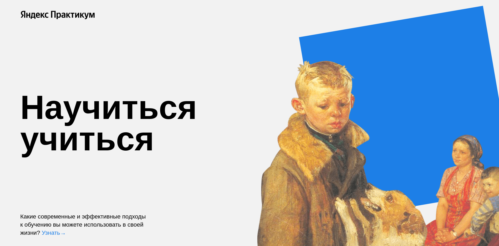

# Научиться учиться
Небольшой информативный веб-сайт для знакомства с эффективными методами обучения

## Технологии
- **HTML** - добрый надежный язык гипертекстовой разметки 📋
- **CSS** - каскадные таблицы стилей для описания незабываемого дизайна веб-сайта ✨

## Особенности разработки
- **Flexbox** для верстки
- **Методология БЭМ** для грамотной разработки интерфейса
- **Анимация CSS** для ярких впечатлений о странице

## Будущие улучшения
1. Кроссбраузерная поддержка 🔜
2. Адаптивная верстка 🔜
